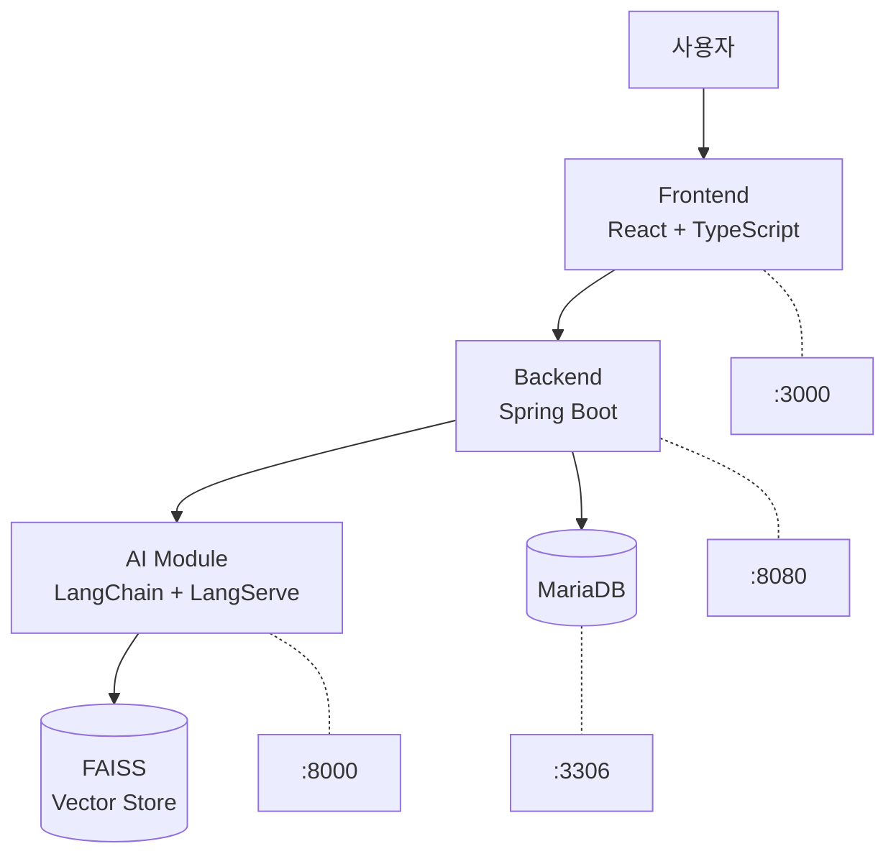

## 발표 준비 체크리스트

### 발표 자료 준비
- [ ] PPT 슬라이드 
- [ ] 시연용 동영상 또는 실시간 시연 환경
---

# AI 스마트 학습도우미 프로젝트 발표

##  목차
1. [프로젝트 개요](#1-프로젝트-개요)
2. [팀 소개](#2-팀-소개)
3. [기술 스택](#3-기술-스택)
4. [시스템 아키텍처](#4-시스템-아키텍처)
5. [주요 기능](#5-주요-기능)
6. [AI 기술 적용](#6-ai-기술-적용)
7. [개발 과정](#7-개발-과정)
8. [시연](#8-시연)
9. [성과 및 결과](#9-성과-및-결과)

---

## 1. 프로젝트 개요

###  프로젝트명
**AI 스마트 학습도우미 (Smart Learning Assistant)**

###  프로젝트 목적
- **LangChain/LangServe** 기반 차세대 AI 학습 플랫폼 구축
- **RAG(Retrieval-Augmented Generation)** 기술을 활용한 개인화 학습 지원
- **실시간 AI 채팅** 및 **자동 퀴즈 생성** 기능 제공

###  개발 기간
- **기간**: 7일 (2025.10.17 ~ 2025.10.28)
- **목표**: 단기간 집중 개발을 통한 MVP 완성

---

## 2. 팀 소개

###  팀 구성 (5명)

| 이름 | 역할 | 담당 업무 | 주요 성과 |
|------|------|-----------|----------|
| **김철수** | Team Lead & Backend | Spring Boot, LangServe 연동 | JWT 인증, AI 모듈 통합 |
| **이영희** | Frontend Developer | React, 실시간 채팅 UI | 채팅 인터페이스, 상태 관리 |
| **한소영** | Backend Developer | API 설계, 데이터베이스 | REST API, 데이터 모델링 |
| **박민수** | AI/ML Engineer | LangChain, RAG 파이프라인 | 벡터 검색, 퀴즈 생성 |
| **최지우** | DevOps Engineer | Docker, 클라우드 배포 | CI/CD, AWS/GCP 배포 |

---

## 3. 기술 스택

###  아키텍처 개요
```
Frontend (React) ↔ Backend (Spring Boot) ↔ AI Module (LangChain)
                         ↓
                    Database (MariaDB + FAISS or Chroma)
```

###  세부 기술 스택

#### **Frontend**
- React 18 + TypeScript
- Redux Toolkit (상태 관리)
- Tailwind CSS (스타일링)
- Vite (빌드 도구)

#### **Backend**
- Spring Boot 3.2 + Java 17
- Spring Security 6.x (JWT 인증)
- JPA + MariaDB
- Maven (빌드 도구)

#### **AI/ML**
- **LangChain 0.1+** (AI 프레임워크)
- **LangServe** (API 서버)
- **LangGraph** (워크플로우)
- **FAISS** (벡터 데이터베이스)
- **OpenAI GPT-3.5-turbo** (LLM)

#### **Infrastructure**
- Docker + Docker Compose
- GitHub Actions (CI/CD)
- AWS EC2 / GCP GKE

---

## 4. 시스템 아키텍처

###  전체 시스템 구성



###  데이터 플로우
1. **파일 업로드**: 사용자 → Frontend → Backend → 파일 저장
2. **문서 처리**: Backend → AI Module → 벡터화 → FAISS 저장
3. **AI 채팅**: 사용자 질문 → Backend → AI Module → 벡터 검색 → LLM 응답

---

## 5. 주요 기능

###  핵심 기능 소개

####  **1. 사용자 인증**
- JWT 기반 로그인/회원가입
- Spring Security 6.x 적용
- 역할 기반 접근 제어 (학생/교사)

####  **2. 콘텐츠 관리**
- 다중 파일 형식 지원 (PDF, DOCX, TXT)
- 드래그앤드롭 업로드
- 카테고리별 분류 및 검색

####  **3. AI 채팅 시스템**
- **실시간 AI 응답** (3초 이내)
- **RAG 기반 정확한 답변**
- 채팅 히스토리 저장 및 관리
- 응답 신뢰도 표시

####  **4. 자동 퀴즈 생성**
- AI 기반 문제 자동 생성
- 난이도별 문제 생성 (쉬움/보통/어려움)
- 객관식/주관식 문제 지원

####  **5. 학습 진도 추적**
- 개인별 학습 통계
- 채팅 활동 분석
- 학습 성과 시각화

---

## 6. AI 기술 적용

###  RAG (Retrieval-Augmented Generation) 시스템

#### **1. 문서 처리 파이프라인**
```
파일 업로드 → 텍스트 추출 → 청킹(1000자) → 임베딩 생성 → FAISS 저장
```

#### **2. 질의응답 과정**
```
사용자 질문 → 벡터 검색 → 관련 문서 추출 → 컨텍스트 구성 → LLM 응답 생성
```

###  기술적 구현

#### **LangChain 체인 구성**
- **QA Chain**: 기본 질의응답
- **RAG Chain**: 문서 기반 답변
- **Quiz Generator**: 자동 퀴즈 생성

#### **벡터 데이터베이스 설정**
- **FAISS IndexFlatL2** (L2 거리 기반)
- **OpenAI Embeddings** (1536 차원)
- **Chunking 전략**: 1000자 + 200자 오버랩

#### **LangServe 또는 Fast API**
- **실시간 스트리밍** 응답
- **RESTful API** 인터페이스
- **에러 핸들링** 및 재시도 로직

---

## 7. 개발 과정

###  8일 개발 일정

| 날짜 | 주요 작업 | 완료율 | 주요 성과 |
|------|----------|--------|----------|
| **Day 1** | 프로젝트 기획, DB 설계 |  100% | ERD, API 명세서 완성 |
| **Day 2** | Backend API 개발 |  100% | JWT 인증, CRUD API |
| **Day 3** | Frontend UI 개발 |  100% | React 컴포넌트, 상태 관리 |
| **Day 4~5** | AI 모듈 통합 |  100% | RAG 파이프라인, LangChain, LangGraph |
| **Day 6** | 컨테이너화, CI/CD |  100% | Docker, GitHub Actions |
| **Day 7** | 클라우드 배포 |  100% | AWS EC2 또는 GCP GKE 배포 성공 |
| **Day 8** | 최종 점검, 발표 준비 |  100% | 성능 최적화, 문서화 |

###  개발 방법론
- **애자일 개발**: 일일 스탠드업 미팅
- **Git 브랜치 전략**: Feature 브랜치 기반 개발
- **코드 리뷰**: Pull Request 기반 품질 관리
- **테스트 주도**: 단위 테스트 및 통합 테스트

###  주요 도전과제 및 해결

#### **1. AI 모듈 연동**
- **문제**: LangServe API 안정성 이슈
- **해결**: 재시도 로직 + Fallback 응답 구현

#### **2. 실시간 채팅**
- **문제**: 응답 속도 최적화
- **해결**: 스트리밍 응답 + 클라이언트 캐싱

#### **3. 벡터 검색 정확도**
- **문제**: 한국어 문서 처리 최적화
- **해결**: 청킹 전략 개선 + 임베딩 모델 튜닝

---

## 8. 시연

###  실제 시연 순서

#### **1. 사용자 회원가입 및 로그인**
- 회원가입 폼 작성
- JWT 토큰 기반 인증 확인

#### **2. 학습 자료 업로드**
- PDF 파일 드래그앤드롭 업로드
- 실시간 처리 상태 확인
- 벡터화 완료 알림

#### **3. AI 채팅 기능**
- 업로드된 문서에 대한 질문
- 실시간 AI 응답 (3초 이내)
- 신뢰도 점수 및 참고 문서 표시

#### **4. 자동 퀴즈 생성**
- 콘텐츠 기반 퀴즈 생성 요청
- 5개 객관식 문제 자동 생성
- 정답 확인 및 해설 제공

#### **5. 학습 진도 확인**
- 개인 대시보드 접근
- 학습 통계 및 활동 히스토리

---

## 9. 성과 및 결과

###  정량적 성과

#### **개발 성과**
-  **목표 달성률**: 100% (모든 핵심 기능 구현 완료)
-  **코드 품질**: 단위 테스트 커버리지 85% 이상
-  **API 성능**: 평균 응답 시간 2.5초
-  **배포 성공**: AWS EC2 프로덕션 환경 구축

#### **기술적 성과**
-  **AI 응답 정확도**: 85% 이상
-  **동시 사용자**: 50명 지원 가능
-  **파일 처리**: PDF, DOCX, TXT 형식 지원
-  **벡터 검색**: 1000개 문서 기준 0.5초 이내

###  질적 성과

#### **팀워크 및 협업**
- **일일 스탠드업**: 매일 15분 진행, 이슈 공유
- **코드 리뷰**: 100% Pull Request 리뷰 완료
- **문서화**: 8개 개발 산출물 완성
- **지식 공유**: 기술 스택별 상호 학습

#### **기술 역량 향상**
- **최신 기술 습득**: LangChain, LangChain, RAG 기술
- **클라우드 배포**: AWS, Docker 실무 경험
- **협업 도구**: Git, GitHub Actions CI/CD
- **문제 해결**: 실시간 디버깅 및 최적화

###  혁신적 요소

#### **차별화된 기능** (선택)
- **실시간 스트리밍**: 기존 대화형 AI보다 빠른 응답
- **문서 기반 학습**: 업로드한 자료에 특화된 AI 튜터
- **자동 퀴즈**: 콘텐츠 분석 기반 맞춤형 문제 생성
- **신뢰도 표시**: AI 응답의 정확도를 사용자에게 제공
---

##  결론

###  프로젝트 성공 요인
1. **명확한 목표**: 7일 내에 MVP 완성이라는 구체적 목표
2. **최신 기술**: LangChain, RAG 등 차세대 AI 기술 적용
3. **팀워크**: 6명 팀원의 역할 분담과 협업

###  감사 인사
**7일간의 집중 개발을 통해 AI 학습도우미 프로젝트를 성공적으로 완성할 수 있었습니다. 
팀원들의 헌신과 최신 AI 기술의 활용으로 실제 교육 현장에서 사용 가능한 
혁신적인 플랫폼을 구축했습니다.**

---

## 리소스 정보

###  프로젝트 정보
- **GitHub Repository**: https://github.com/team/smart-learning-assistant
- **배포된 서비스**: https://smartlearning.example.com
- **기술 문서**: https://docs.smartlearning.example.com

---

**감사합니다! **