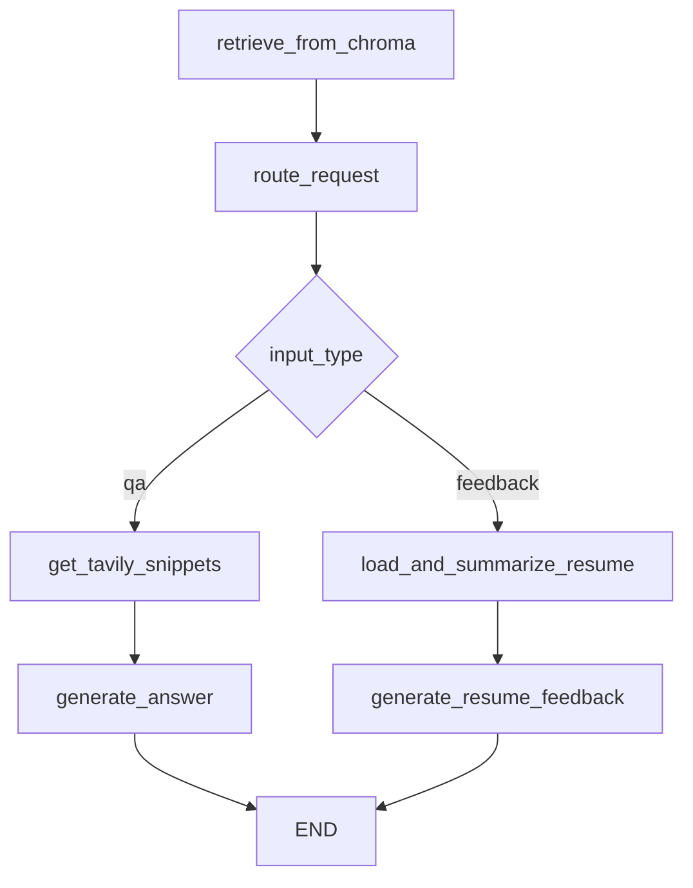

# AI 모듈 연동 명세서

## 1. 기술 스택
- **AI Framework**: LangChain + LangGraph
- **API 서버**: FastAPI
- **Vector DB**: ChromaDB
- **LLM**: Google Gemini 2.5 Pro
- **Embeddings**: Ollama BGE-M3
- **Web Search**: Tavily API
- **Monitoring**: LangSmith

## 2. 프로젝트 구조
```
ai_module/
├── .github/workflows/   # GitHub Actions 워크플로우
├── chroma/             # ChromaDB 데이터 저장소
├── images/             # 이미지 파일들
├── llm-service/        # LLM 서비스 폴더
│   ├── data/          # 데이터 폴더
│   ├── file_data/     # 파일 데이터
│   ├── news_data/     # 뉴스 데이터
│   ├── test_data/     # 테스트 데이터
│   ├── __init__.py    # 패키지 초기화
│   ├── chat_langgraph.py       # 채팅 LangGraph
│   ├── chromadb_news_test.py   # ChromaDB 뉴스 테스트
│   ├── chromadb_resume_test.py # ChromaDB 이력서 테스트
│   ├── main.py        # 메인 실행 파일
│   └── summarizer.py  # 요약기
├── .gitignore         # Git 무시 파일
├── README.md          # 프로젝트 설명서
├── agent_workflow.png # 에이전트 워크플로우 다이어그램
├── docker-compose.yml # Docker Compose 설정
├── entrypoint.sh      # 컨테이너 진입점 스크립트
├── insert_sample_data.py      # 샘플 데이터 삽입
├── llm-service.Dockerfile     # LLM 서비스 Dockerfile
├── ollama.Dockerfile          # Ollama Dockerfile
├── pyproject.toml     # Python 프로젝트 설정
└── test_resume.txt    # 테스트 이력서 파일
```

## 3. 환경 설정
```env
# LLM APIs
GOOGLE_API_KEY=
TAVILY_API_KEY=

# Vector DB
VECTOR_DB_HOST=
VECTOR_DB_PORT=8001

# Embeddings
OLLAMA_BASE_URL=http://localhost:11434

# Backend Integration
SPRING_SERVER_URL=http://18.233.156.168:8080

# Monitoring
LANGSMITH_API_KEY=
LANGSMITH_PROJECT=llm-service-already
LANGSMITH_TRACING=true
LANGSMITH_ENDPOINT=
```

# 서버 설정
HOST=0.0.0.0
PORT=8000
```

## 4. 주요 API

### 4.1 채팅 API
- **POST** `/chat`
  - **Content-Type**: `multipart/form-data`
  - **Parameters**:
    - `request` (Form): JSON 형태의 요청 데이터
    - `file` (File, Optional): 업로드된 파일 (PDF/TXT)
  - **Request Body**:
    ```json
    {
      "session_id": 1,
      "user_id": 1,
      "question": "질문 내용",
      "chat_message_id": 1,
      "news_id": 101,
      "company": "기업명",
      "chat_history": [
        {"type": "human", "content": "이전 질문"},
        {"type": "ai", "content": "이전 답변"}
      ]
    }
    ```
  - **Response**:
    ```json
    {
      "session_id": 1,
      "chat_message_id": 1,
      "question": "질문 내용",
      "answer": "AI 답변 내용"
    }
    ```

### 4.2 뉴스 요약 API
- **POST** `/summarize`
  - **Request Body**:
    ```json
    {
      "id": 101,
      "title": "뉴스 제목",
      "content": "뉴스 내용",
      "company_name": "기업명"
    }
    ```
  - **Response**:
    ```json
    {
      "summary": "요약 내용",
      "error": false,
      "error_content": ""
    }
    ```

### 4.3 헬스체크 API
- **GET** `/`
  - **Response**: 서버 상태 메시지

## 5. RAG 시스템 & Graph 워크플로우

### 5.1 문서 처리 파이프라인
1. **파일 로드**: PyPDFLoader, TextLoader, ChromaDB에서 데이터 검색
2. **텍스트 분할**: 청크 단위로 분할
3. **임베딩 생성**: OllamaEmbeddings "bge-m3:latest"
4. **벡터 저장**: ChromaDB

### 5.1.1 응답 과정
1. **문서 검색**: news_id 필터로 해당 뉴스의 모든 청크 검색 (k=20)
2. **데이터 전처리**: JSON 형태 청크에서 실제 텍스트 추출
3. **컨텍스트 구성**: 검색된 청크들을 하나의 문자열로 결합
4. **LLM 응답 생성**: Google Gemini 2.5 Pro 모델 로 최종 답변 생성

### 5.2 워크플로우 구조


### 5.2.1 주요 노드 기능
1. **retrieve_from_chroma**: ChromaDB에서 뉴스 관련 청크 검색
2. **route_request**: 요청 유형 분석 (QA vs 피드백)
3. **get_tavily_snippets**: 웹 검색을 통한 최신 정보 수집
4. **generate_answer**: RAG 기반 답변 생성
5. **load_and_summarize_resume**: 이력서 로드 및 요약
6. **generate_resume_feedback**: 맞춤형 피드백 생성

## 6. Vector DB 설정

### 6.1 ChromaDB 컬렉션
- **news_vector_db**: 뉴스 원문 저장
- **user_resume_db**: 사용자 이력서 요약 저장

### 6.2 임베딩 설정
- **모델**: BGE-M3 (via Ollama)
- **청크 크기**: 1000자
- **오버랩**: 200자
- **메타데이터**: news_id, session_id, user_id

### 6.3 검색 설정
- **검색 방식**: 메타데이터 필터링 + 의미 검색
- **반환 개수**: 최대 5개 청크
- **필터링**: news_id 기반

## 7. Backend 연동

### 7.1 Spring 서버 연동
- **뉴스 원문 조회**: `GET /news/{news_id}/detail`
- **타임아웃**: 10초
- **에러 처리**: HTTP 상태 코드 기반
- **자동 캐싱**: VectorDB에 없는 경우 자동 저장

### 7.2 데이터 플로우
1. 클라이언트 요청 수신
2. ChromaDB에서 뉴스 확인
3. 없으면 Spring 서버에서 원문 조회
4. 원문을 청크로 분할 후 ChromaDB 저장
5. LangGraph 워크플로우 실행
6. file이 첨부된 경우 ChromaDB에 요약본 저장
7. 요약본 기반 답변 생성
8. 결과 반환

## 8. 지원 파일 형식
- **PDF**: PyPDFLoader 사용
- **TXT**: TextLoader 사용 (UTF-8 인코딩)
- **임시 저장**: tempfile 모듈 사용
- **자동 삭제**: 처리 완료 후 임시 파일 삭제

## 9. AI 모델 설정

### 9.1 LLM 설정
- **Primary**: Google Gemini 2.5 Pro
- **Temperature**: 0.7
- **Max Retries**: 2

### 9.2 프롬프트 엔지니어링
- **뉴스 QA**: 사용자 질문 + 기업 뉴스 + 기업 연관 웹 검색 결과 결합
- **이력서 피드백**: 사용자 요청 + 기업 뉴스 + 이력서 요약본 결합
- **출력 정제**: 마크다운 태그 및 불필요한 내용 제거

## 10. 모니터링 및 추적

### 10.1 LangSmith 통합
- **프로젝트**: llm-service-already
- **추적 대상**: 모든 LLM 호출 및 체인 실행
- **@traceable 데코레이터**: 주요 함수에 적용

### 10.2 로깅
- **단계별 로깅**: 각 노드 실행 상태 출력
- **에러 로깅**: 예외 발생 시 상세 정보 출력
- **성능 로깅**: 처리 시간 및 결과 통계

## 11. 보안 및 제한사항

### 11.1 파일 업로드 제한
- **임시 저장**: 처리 후 자동 삭제
- **파일 크기**: FastAPI 기본 제한 적용
- **허용 확장자**: .pdf, .txt

### 11.2 API 제한
- **ChromaDB 연결**: HTTP 클라이언트 사용
- **타임아웃**: 10초 (Spring 서버)
- **재시도**: LLM 호출 시 최대 2회

## 12. 배포 설정

### 12.1 Docker 환경
- **서버 포트**: 8000
- **ChromaDB 포트**: 8001
- **Ollama 포트**: 11434

### 12.2 의존성 서비스
- **ChromaDB**: 별도 컨테이너에서 실행
- **Ollama**: 임베딩 모델 서빙
- **Spring Backend**: 뉴스 원문 제공

## 13. 성능 최적화

### 13.1 캐싱 전략
- **VectorDB 캐싱**: 한 번 저장된 뉴스는 재사용
- **이력서 캐싱**: 세션별 이력서 요약본 저장
- **LLM 출력 정제**: 불필요한 토큰 제거

### 13.2 비동기 처리
- **FastAPI 비동기**: async/await 패턴 사용
- **HTTP 클라이언트**: httpx 비동기 클라이언트
- **파일 처리**: 스트리밍 방식 지원

## 14. 테스트

### 14.1 단위 테스트
- **시나리오 1**: 뉴스 Q&A 테스트
- **시나리오 2**: 이력서 피드백 테스트
- **뉴스 요약 테스트**: 뉴스 요약본 추출 테스트
- **파일 테스트**: PDF/TXT 업로드 테스트

### 14.2 통합 테스트
- **Spring 연동**: 뉴스 원문 조회 테스트
- **ChromaDB 연동**: 벡터 저장/검색 테스트
- **LangGraph 워크플로우**: 전체 플로우 테스트